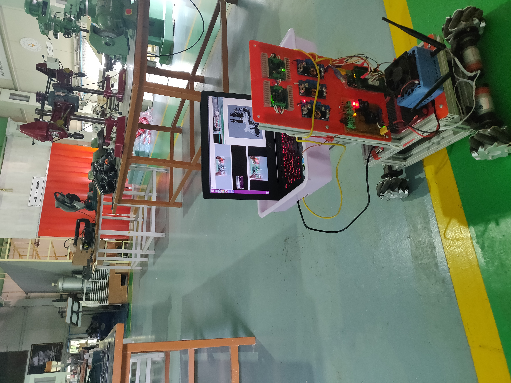

<p align="center">
# **Mohammed Maaruf Vazifdar**
</p>
Hi, I am a Graduate Studnet at the University of Maryland, currently pursuing Masters in Engineering - Robotics.
I completed my undergraduate in BTech in Mechatronics Engineering in 2020, which sparked my interest in robotics.

### [Academic Resume](/files/maaruf_resume_umd.pdf)

## Technical Skills 
- Python
- C++
- ROS
- Gazebo
- AWS RoboMaker
- Solidworks
- Robot Modelling and prototyping

Projects
========

### **Faby - The Telepresence Robot**
<!--  -->
<p align="center">

 
</p>

- Developed a telepresence robot that could autonomously navigate through an indoor environment with dynamic obstacle avoidance.
- Features included bi-directional video conferencing, interactive user-interface, and remote control over internet.
- *My contribution*: Worked deployment, tuning the ROS navigation stack, configuring Intel RealSense with navigation package, Imu data acquisition.
- Wrote python scripts for providing nav_goals via a GUI, robot CAD design, prototyping and fabrication, creating URDF and world for simulations, adding plugins for various sensors, navigation package, localization using Aruco markers.
- Gazebo simulation of the robot [Faby](https://github.com/maarufvazifdar/faby_sim).

### **Telepresence Robot for Medical Assistance**

- Develop a robot to assist healthcare professionals in hospitals during the Covid-19 pandemic.

### **Food Serving Robot**
<p align="center">

</p>
- Simulation of a robot waiter in cafe environment. [Github Repo](https://github.com/maarufvazifdar/food_serving_robot)

### **Shamazon_Warehouse_Robot**
- The project demonstrates a delivery robot with autonomous capabilities, static, and dynamic obstacle avoidance. The robot will navigate to a conveyor belt to receive a package and will navigate through a map to deliver it between departments inside a warehouse with multiple levels, the robot can use elevator gazebo plugin to communicate, know the state and location of the elevator, and upon reaching the desired level/ floor, update the map. Finally, on reaching the goal the package will be delivered by the robot’s conveyor belt. [Github Repo](https://github.com/maarufvazifdar/shamazon_robot)


Technical Experience
===========
**Drishti Works, Mumbai - *Robotics Software Engineer- Intern***
  - Create realistic and robust robot simulations and environments using ROS and Gazebo to ensure the
  optimal performance of robots on deployment.
  - Cloud based deployment, monitoring and management of robot applications using the AWS
  RoboMaker services.

**SRM ASV - *Mechanical Lead* (During undergrad)**
<p align="center">

</p>
- SRM ASV is a student research team which focuses on developing Autonomous Surface Vehicles.
- Was responsible for Team management, Mechanical design, CFD Analysis, Fabrication and Prototyping of the boat hull and mechanisms.
- [ASV designs and images](https://drive.google.com/drive/u/2/folders/1HhZRPbZommBlfuW9XI7QwKbouBcnGt4x)

**Reliance Industries Limited, Silvassa Manufacturing Division - *Intern***

**Oil and Natural Gas Limited, Hazira - *Intern***

<!-- 
#### Header 4

*   This is an unordered list following a header.
*   This is an unordered list following a header.
*   This is an unordered list following a header.

##### Header 5

1.  This is an ordered list following a header.
2.  This is an ordered list following a header.
3.  This is an ordered list following a header.

###### Header 6

| head1        | head two          | three |
|:-------------|:------------------|:------|
| ok           | good swedish fish | nice  |
| out of stock | good and plenty   | nice  |
| ok           | good `oreos`      | hmm   |
| ok           | good `zoute` drop | yumm  |

### There's a horizontal rule below this.

* * *

### Here is an unordered list:

*   Item foo
*   Item bar
*   Item baz
*   Item zip

### And an ordered list:

1.  Item one
1.  Item two
1.  Item three
1.  Item four

### And a nested list:

- level 1 item
  - level 2 item
  - level 2 item
    - level 3 item
    - level 3 item
- level 1 item
  - level 2 item
  - level 2 item
  - level 2 item
- level 1 item
  - level 2 item
  - level 2 item
- level 1 item

### Small image


### Large image


### Definition lists can be used with HTML syntax.

<dl>
<dt>Name</dt>
<dd>Godzilla</dd>
<dt>Born</dt>
<dd>1952</dd>
<dt>Birthplace</dt>
<dd>Japan</dd>
<dt>Color</dt>
<dd>Green</dd>
</dl>

```
Long, single-line code blocks should not wrap. They should horizontally scroll if they are too long. This line should be long enough to demonstrate this.
```

```
The final element.
``` -->
